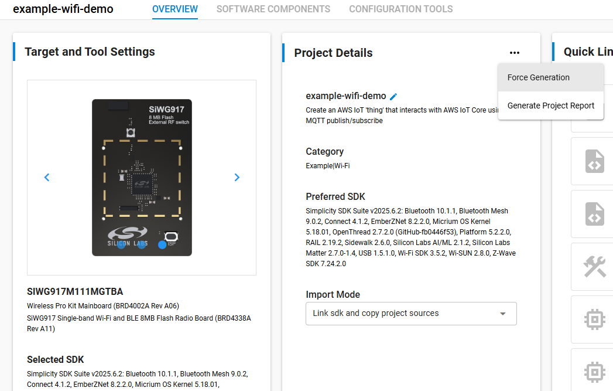

# uLogger WiFi Example

This example demonstrates how to integrate uLogger into a WiFi application running on a Silicon Labs SiWG917 device. The embedded firmware logs binary debug data over MQTT to publish to the uLogger cloud platform.

The uLogger agent is vendored into this project: the headers in `include/` and the static library in `lib/` are copied from the [embedded_agent](https://github.com/ulogger-ai/embedded_agent) distribution. The pinned version is in `include/ulogger_version.h` — currently **v1.2.6**.

## Prerequisites

- [Simplicity Studio 5](https://www.silabs.com/developers/simplicity-studio) with the Gecko SDK installed
- A supported Silicon Labs radio board (BRD4002A with SiWG917 module, BRD2605A)
- A [uLogger](https://www.ulogger.ai) account
- GNU ARM Toolchain - GNU ARM v12.2.1
- Silicon Labs Simplicity SDK 2025.6.2
- WiseConnect SDK 3.5.2

---

## 1. Import the demo example into your worksapce

1. In Simplicity studio, click File->Import
2. Browse to folder where you checked out the uLogger example-wifi-demo
3. Select the Simplicity Studio (.sls) project and click next
4. Make Sure the SDK and toolchain text is not showing red. If it is red, that means you'll need to download those packages in the package manager. Click next.
5. Uncheck the box for `Use default location` and change the location to point the location where you downloaded the repo. It should include the name of the folder itself. An example would be `C:\my-demo-app\example-wifi-demo`
6. Click Finish to complete the import.
7. Expand the project and open the `example-wifi-demo.slcp` in the project files.
8. In the Project Details section, click the `...` in the top right corner and select `Force Generation` to complete the project setup.




---

## 2. Create Your uLogger Account

1. Go to [ulogger.ai](https://www.ulogger.ai) and create an account.
2. Log in and follow the setup instructions to create a test application.
3. After creating the application, copy the **Application ID** displayed in the web application.

---

## 3. Configure the Firmware

Open the file `config/sl_net_default_values.h`. Set the field `DEFAULT_WIFI_CLIENT_PROFILE_SSID` to your access point SSID and `DEFAULT_WIFI_CLIENT_CREDENTIAL` to the access point passphrase.

All locations that require your credentials are marked with the comment pattern `ULOGGER TODO`. Search for this pattern in the project to find every location you need to update.

### Set the Application ID

Open `include/ulogger_config.h` and update the `APPLICATION_ID` define with the Application ID from your uLogger cloud account. If your account uses groups, also set `ULOGGER_GROUP_ID` to the group your device belongs to (use `0` if you are not using groups):

```c
// ULOGGER TODO
#define APPLICATION_ID <your_application_id>
#define ULOGGER_GROUP_ID <your_group_id>
```

---

## 4. Configure the Credentials

### Download Your MQTT Certificates

1. Log in to the uLogger web application.
2. Click **Settings** in the navigation panel.
3. Click **Download MQTT Certificate**.
4. Extract the downloaded zip file and copy the following three files into the project directory:
   - `certificate.pem.crt`
   - `private.pem.key`
   - `ulogger_certs_keys.h`

### Set Your Customer ID

Open `wifi_example.json` and update the `customer_id` and `application_id` to match the values that you recorded in steps 3 and 4.

> Note: MQTT topics now include a `group_id` segment (`.../{customer_id}/{group_id}/{application_id}/...`). The `group_id` used at runtime comes from the `ULOGGER_GROUP_ID` define in `include/ulogger_config.h`, not from `wifi_example.json`.

---

## 5. Publish the AXF File to uLogger Cloud

The AXF file carries the debug symbols the cloud needs to decode this firmware's binary logs. The cloud matches them to incoming logs on the **version string**, so it has to be re-uploaded whenever you change the firmware or bump `.version_string` in `app.c`. A stale AXF fails quietly: logs arrive and simply cannot be decoded, with nothing to say why.

Under Simplicity Studio 6 the build output is `cmake_gcc/build/base/example-wifi-demo.out` — the same ELF-with-symbols, just renamed from `.axf`. `wifi_example.json` already points at it.

1. Download the uLogger upload client from [https://ulogger.ai/downloads.html](https://ulogger.ai/downloads.html).

2. Put your MQTT certificates in the project directory. Download the bundle from the uLogger web app (or `get_certificate_bundle` over MCP) and unpack `certificate.pem.crt` and `private.pem.key` here. They are gitignored.

   The upload authenticates with these, so a certificate belonging to a different customer fails with a bare `403 Forbidden` that says nothing about which account it expected.

3. Set your account identifiers. These override the placeholders in `wifi_example.json`, so you do not have to edit (or accidentally commit) them:

   ```bash
   export ULOGGER_CUSTOMER_ID=<your customer id>
   export ULOGGER_APPLICATION_ID=<your application id>
   ```

4. To upload by hand:

   ```bash
   ulogger-upload -json wifi_example.json -project_dir . \
       -customer_id $ULOGGER_CUSTOMER_ID -application_id $ULOGGER_APPLICATION_ID
   ```

   To have it run automatically after every build, point `ULOGGER_UPLOAD` at the client and reconfigure:

   ```bash
   export ULOGGER_UPLOAD=/path/to/ulogger-upload
   cmake --preset <your preset>      # or -DULOGGER_UPLOAD=/path/to/ulogger-upload
   ```

   With `ULOGGER_UPLOAD` unset the step is skipped and the build is unaffected. With it set, a failed upload fails the build — having opted in, a silent miss is the outcome worth avoiding.

> Under Simplicity Studio 5 this ran from the Eclipse `Build Steps` project setting. SS6 builds through CMake and does not carry that setting over, so it now lives in `cmake_gcc/CMakeLists.txt`.

---

## 6. Build and Flash
Build the Simplicity Studio project and flash it to your device. 

## 7. Generate Logs
Follow the log instructions that are displayed via the debug output on the virtual com port. You can generate logs and a hard fault by pressing BUTTON0.

## How this example uses uLogger

This section is not part of the setup walkthrough — it describes what the demo code does, and what to change when you adapt it to your own hardware. For the full integration guide see the [embedded_agent README](https://github.com/ulogger-ai/embedded_agent).

### The log transfer cycle

The publish path in `mqtt.c` follows a **seal → read → consume** cycle:

1. `ulogger_seal_nv_logs_for_transfer()` freezes the current NV contents and returns the size of that snapshot, which is used to size the publish buffer.
2. `ulogger_read_nv_logs_with_header()` fills the buffer — a 25-byte header followed by the log data — and it is published to the binary-log MQTT topic.
3. On a successful publish, `ulogger_consume_nv_logs()` discards the snapshot.

The last step uses `ulogger_consume_nv_logs()` rather than `ulogger_clear_nv_logs()` deliberately. Clearing erases the whole region, which would destroy any log written *while the publish was in flight*; consuming discards only the sealed snapshot.

> **Duplicates after a reset.** The consume position lives in RAM, so a reset re-offers everything still physically present in the NV region — including entries already delivered but not yet erased. Expect duplicates of up to a region's worth of entries after a reset. This is the deliberate trade for not losing entries written during a transfer. Note that tick values cannot be used to de-duplicate, because the tick counter restarts at 0 on reset.

### Non-volatile storage is simulated

**This demo does not use real non-volatile memory.** `app.c` backs both uLogger regions with a single static RAM buffer placed in `.noinit`:

| Region | Offset | Size | Purpose |
|---|---|---|---|
| `ULOGGER_MEM_TYPE_DEBUG_LOG` | `0` | 1500 bytes | Binary logs |
| `ULOGGER_MEM_TYPE_STACK_TRACE` | `1500` | 1100 bytes | Crash dumps |

`.noinit` means the contents survive a **reset**, which is what lets a crash dump be captured and then published after reboot — but they do **not** survive a power cycle. For a production port, replace `ulogger_nv_mem_read/write/erase()` with real flash routines and point the regions at a flash area reserved in your linker script.

`erase_granularity` is set to `NV_SIM_PAGE_SIZE` (100 bytes), a stand-in for a flash page. It switches the library onto page-wise reclaim, so a transfer stops discarding entries written while it was in flight. On real hardware, set this to the erasable unit of your part — the same constant your `erase()` driver steps by. The library only uses the value if `start_addr` *and* the region length are both multiples of it, otherwise it silently falls back to whole-region erases.

### Logging configuration

The demo logs at `ULOG_DEBUG` with all modules enabled, and the cloud can change both at runtime — `mqtt.c` subscribes to a config topic and applies updates via `ulogger_set_flags_level()`.

Note that `pretrigger_log_count` is **0** in this example, so the pretrigger buffer is effectively disabled and every log that passes the filter goes straight to NV. Raise it (and keep `pretrigger_buffer_size` large enough) if you want the dash-cam behaviour of retaining recent lower-severity logs and flushing them only when something goes wrong.

### Crash dumps

`fault_reboot_cb` runs once a dump is captured. As of agent v1.2.5 it takes the crash cause:

```c
static void fault_reboot(uint8_t cause) {
    (void)cause;   // one of ULOGGER_CRASH_CAUSE
    NVIC_SystemReset();
}
```

This demo resets the same way for every cause; an application that needs to recover differently from a watchdog bite than from a CPU fault can branch on `cause` here.

### `ulogger_config.h` is yours

`include/ulogger_config.h` holds your module list, application ID, group ID and NV addresses. It is **not** shipped by the agent distribution, so updating the vendored library will never overwrite your settings.

---

## Exploring the web platform
Now that you have successfully published logs into uLogger Cloud, let's review how to view those.

### Hard Faults
1. Click on **Hard Faults** on the left navigation panel. You should see at least one hard fault in the list.
2. Click on the error summary text to expand the entry. You should see the full stack trace, hard fault status registers, and general registers.

### Debug Logs
1. Click on **Debug Logs** on the left navigation panel. You should see at least one error message in the list. Click the error text to expand the log message.
2. Click on the device address of your specific device to open the log history for that specific device. You should now see several logs captured prior to the error message and hard fault.

### Fix with AI
If you forked this repo and provide your github settings, you can send this context to your AI coding agent to analyze and create a pull request to fix for you. Even if you haven't configured your github settings, you can still follow the steps even though the pull request won't get generated.
1. Hold shift and click on the first log that you want to be included in the context and then the last log. This selects the range of interest if you don't want to send all logs as part of the context.
2. Click the Fix with AI button in the top right corner. This will display a new modal with your selected log context and the option to provide additional user context if desired.
3. Click submit to create the issue for the AI tools to analyze and fix.

There is more to explore in the web platform, but that is all that is covered in this demo. Check some of our other demos and videos to learn more!